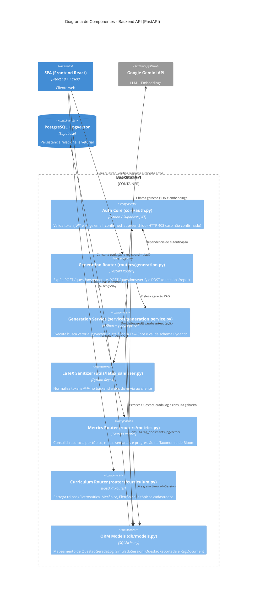

# Diagrama C4 Nível 3: Componentes do Backend API

Este diagrama detalha os componentes internos do container **Backend API (FastAPI)**.

```mermaid
C4Component
    title Diagrama de Componentes - Backend API (FastAPI)

    Container_Boundary(api, "Backend API") {
        Component(core_auth, "Auth Core (core/auth.py)", "Python / Supabase JWT", "Valida token JWT e exige email_confirmed_at preenchido (HTTP 403 caso não confirmado)")
        Component(router_gen, "Generation Router (routers/generation.py)", "FastAPI Router", "Expõe POST /questions/generate, POST /questions/verify e POST /questions/report")
        Component(service_gen, "Generation Service (services/generation_service.py)", "Python + google-genai", "Executa busca vetorial pgvector, injeta âncora Few-Shot e valida schema Pydantic")
        Component(latex_utils, "LaTeX Sanitizer (utils/latex_sanitizer.py)", "Python Regex", "Normaliza tokens @@ no backend antes do envio ao cliente")
        Component(router_metrics, "Metrics Router (routers/metrics.py)", "FastAPI Router", "Consolida acurácia por tópico, metas semanais e progressão na Taxonomia de Bloom")
        Component(router_curr, "Curriculum Router (routers/curriculum.py)", "FastAPI Router", "Entrega trilhas (Eletrostática, Mecânica, Eletrônica) e tópicos cadastrados")
        Component(db_models, "ORM Models (db/models.py)", "SQLAlchemy", "Mapeamento de QuestaoGeradaLog, SimuladoSession, QuestaoReportada e RagDocument")
    }

    Container(spa, "SPA (Frontend React)", "React 19 + KaTeX", "Cliente web")
    System_Ext(gemini, "Google Gemini API", "LLM + Embeddings")
    ContainerDb(db, "PostgreSQL + pgvector", "Supabase", "Persistência relacional e vetorial")

    Rel(spa, router_gen, "Gera questão, verifica resposta e reporta erros", "HTTPS/JSON")
    Rel(spa, router_metrics, "Consulta evolução e registra simulado", "HTTPS/JSON")
    Rel(spa, router_curr, "Lista trilhas e ementas", "HTTPS/JSON")

    Rel(router_gen, core_auth, "Dependência de autenticação")
    Rel(router_metrics, core_auth, "Dependência de autenticação")

    Rel(router_gen, service_gen, "Delega geração RAG")
    Rel(router_gen, latex_utils, "Sanitiza resolução na rota /verify")
    Rel(router_gen, db_models, "Persiste QuestaoGeradaLog e consulta gabarito")

    Rel(service_gen, gemini, "Chama geração JSON e embeddings")
    Rel(service_gen, db_models, "Consulta rag_documents (pgvector)")
    Rel(router_metrics, db_models, "Lê e grava SimuladoSession")
    Rel(db_models, db, "Executa queries SQL")
```
