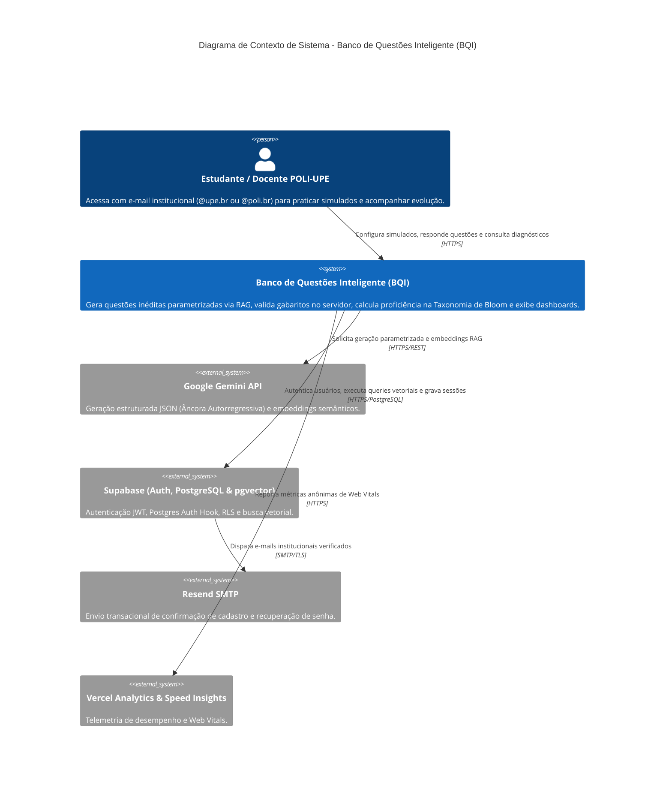

# Diagrama C4 Nível 1: Contexto

Este diagrama descreve o contexto de alto nível do sistema **Banco de Questões Inteligente (BQI)**.

```mermaid
C4Context
    title Diagrama de Contexto de Sistema - Banco de Questões Inteligente (BQI)

    Person(aluno, "Estudante / Docente POLI-UPE", "Acessa com e-mail institucional (@upe.br ou @poli.br) para praticar simulados e acompanhar evolução.")

    System(bqi, "Banco de Questões Inteligente (BQI)", "Gera questões inéditas parametrizadas via RAG, valida gabaritos no servidor, calcula proficiência na Taxonomia de Bloom e exibe dashboards.")

    System_Ext(gemini, "Google Gemini API", "Geração estruturada JSON (Âncora Autorregressiva) e embeddings semânticos.")
    System_Ext(supabase, "Supabase (Auth, PostgreSQL & pgvector)", "Autenticação JWT, Postgres Auth Hook, RLS e busca vetorial.")
    System_Ext(resend, "Resend SMTP", "Envio transacional de confirmação de cadastro e recuperação de senha.")
    System_Ext(vercel, "Vercel Analytics & Speed Insights", "Telemetria de desempenho e Web Vitals.")

    Rel(aluno, bqi, "Configura simulados, responde questões e consulta diagnósticos", "HTTPS")
    Rel(bqi, gemini, "Solicita geração parametrizada e embeddings RAG", "HTTPS/REST")
    Rel(bqi, supabase, "Autentica usuários, executa queries vetoriais e grava sessões", "HTTPS/PostgreSQL")
    Rel(supabase, resend, "Dispara e-mails institucionais verificados", "SMTP/TLS")
    Rel(bqi, vercel, "Reporta métricas anônimas de Web Vitals", "HTTPS")
```
